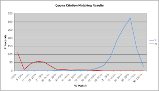

Matching citations to Pubmed is a challenge when the citation information is partially incorrect or presented differently. Some examples of this that are hard to avoid are author names with international characters (diacritical marks, umlauts, tilde, etc) and gene names that include greek characters that are represented in some places as greek symbols and others are alpha-expansions (e.g. tgf-β or tgf-beta). Another source of error is from the manual entry of citations.  
Here is an algorithm to match citations based on partially incorrect citation information:  
  
**Algorithm:**  
  
Parameters:  

- Titletokens = all space delimited title words over 4 chars
- Authors = last name of author

1. Run a search in Pubmed of: ( OR'd together) AND (Authors OR'd together) AND (year OR vol OR firstpage)
2. Retrieve Pubmed records
3. Compare citation fields: Titletokens, Authors, year, vol, firstpage, journal name and keep the best matching Pubmed record

  
There are two ways to improve this citation matching:  

- Use the journal search feature in Pubmed to return ISSN numbers for the Journal name part of the citation record to compare against the Pubmed record OR use a fuzzy match algorithm between the often abbreviated journal name in the citation and the full journal name provided by Pubmed.
- Use a [Lucene](http://lucene.apache.org/java/docs/index.html "Lucene")-based search (or a similar search tool) using standard relevancy ranking of the citation's Titletokens, Authors, year, vol, firstpage, journal name against an field-based index of Medline. The top hit should be the correct citation assuming the relevancy ranking is high enough. One could take the top citation and then run a citation match on it (e.g. Algorithm Step 3) but that might be overkill. Of course, this would require keeping a Lucene index of Medline available and up to date for a citation matching service.

  
Most of the citations are due to mis-spellings (author names or title words) or incorrect citation information, but this is usually due to a field in the citation being incorrect rather than all of the fields in the citation. Of course, some of the incorrect matches or in some cases no matches being found are due to the citation not being in Medline.  
  
Chart\* presenting the bi-modal distribution of %Match (number of tokens matching between citation and Pubmed) vs Number of citations correctly matched to Pubmed records. A score above 70% Token matching between a citation record and a Pubmed record results in very few False Negatives and no False Positives.  
  

  
For more information on the datapoints in the chart above:  
  

| Percent Token Match | Correct | Incorrect |
| --- | --- | --- |
| 0-5% | 0 | 111 |
| 6-10% | 0 | 7 |
| 11-15% | 0 | 43 |
| 16-20% | 0 | 57 |
| 21-25% | 0 | 54 |
| 26-30% | 0 | 28 |
| 31-35% | 1 | 5 |
| 36-40% | 0 | 9 |
| 41-45% | 1 | 3 |
| 46-50% | 1 | 5 |
| 51-55% | 1 | 5 |
| 56-60% | 6 | 3 |
| 61-65% | 15 | 1 |
| 66-70% | 33 | 0 |
| 71-75% | 85 | 0 |
| 76-80% | 188 | 0 |
| 81-85% | 261 | 0 |
| 86-90% | 324 | 0 |
| 91-95% | 132 | 0 |
| 96-100% | 25 | 0 |
| Totals | 1073 | 331 |

  
\* Chart and Table results thanks to my colleague Lulu Chen who curated approximately 1000 proposed citation matches for this project.
