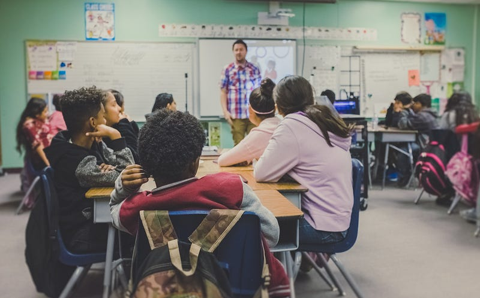

---

### Computer Science Education in Public Schools

*Photo by NeONBRAND on Unsplash*

There has been this massive push to bring computer science education into public schools as part of this whole Code America push. We keep saying that learning to code is a requirement to be a literate citizen in the future (and the future is now).

What we do NOT understand is that we are probably doing more harm than good. Most of the computer science teachers my daughter has had in one of the top-ranked Math and Science Charter schools in the US have been so bad as to drive kids away from computer science and coding. Note — not all of her teachers have been atrocious — some have been excellent (and left to get jobs as developers after a few months of teaching).  
If you can code, and code reasonably well or even poorly, you can get a job making at least 1.5 times what a teacher can make with less hassle. If you can code well, you are looking at 2–3X what a teacher can make in fewer hours of work each week (even during the summer since a teacher generally has to work a summer job or two). There are a few teachers that really love to teach and understand computer science well enough to teach it and are willing to live on much less money than they can comfortably earn.

What this means is that people who cannot code are teaching computer science. This usually results in people who know little about computer science and programming, who feel completely overwhelmed and often feel humiliated by the computer whiz kid or two or 80% of the class and going on power trips to show those darn kids who is in charge. At least, that has been my anecdotal experience from my daughter’s adventures in school (and from my own experience 30 years ago — so this is nothing new).

Poor teaching and teachers result in a lot of kids hating computers (except for playing games on them) due to our public school’s approach to aversion therapy for computer science. If we aren’t going to support computer science in public schools adequately, let’s drop it. Kids that are interested can learn on their own. Schools can tout their excellent computer science programs (learning Word and Excel and Microsoft Paint), and we can stop this unsupported obsession with teaching computer science to everyone.

My obvious premise that I’ve been beating you about the head and shoulders is that we are doing more harm than good with our current approach. We are teaching kids to hate computers and coding. The online learn to code programs, computer science MOOC’s, and a plethora of open source projects/communities will soak up those students who are fascinated by making machines do their bidding. At least, the rest of the students/future citizens won’t hate the thought of computers.
