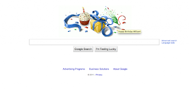

I was quite pleased today to see Google's Birthday wishes to me.  It's impressive how pervasive personalization can be and how nice it is (though still a bit creepy - I've taken to turning off the monitor now when I'm talking about something sensitive --  just kidding :)  
  

