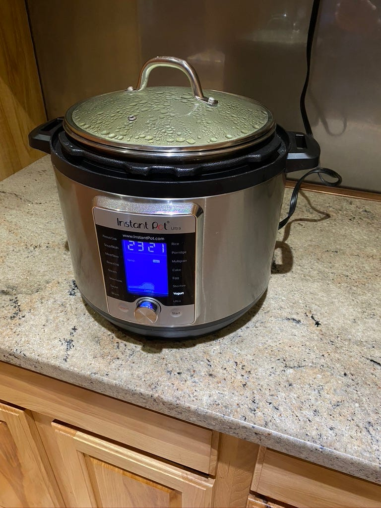
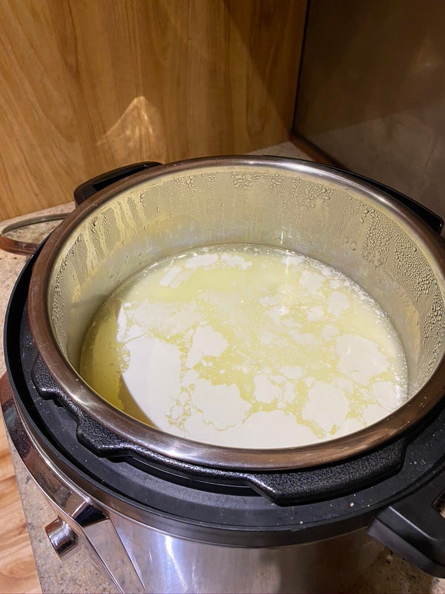
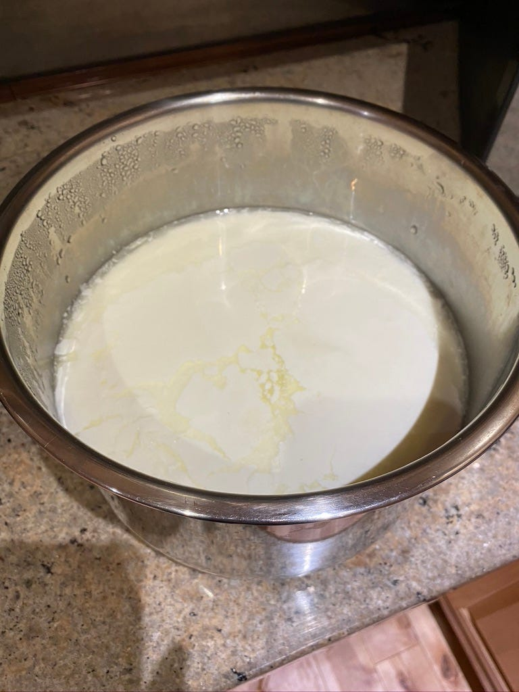
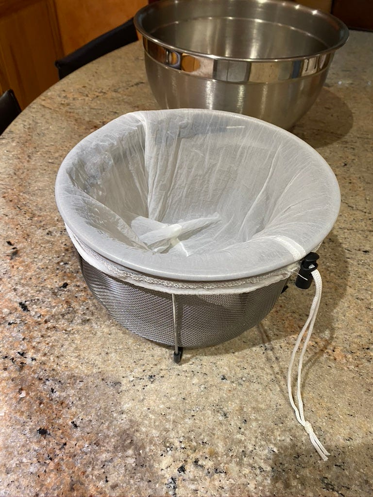

---

*Photo by Sara Cervera on Unsplash*

I’ve spent a lot of time refining my approach to making homemade yogurt. I originally started this because I wanted more dairy in my diet when on a keto diet (I’ll explain further below). We’ve been able to get a higher quality yogurt than is available in the store for a lot less money with minimal effort invested.

### Tools

- [Instant Pot](https://amzn.to/35IRWM5) — not required but it makes this all really easy
- [Glass lid](https://amzn.to/31QZz1B)
- [Yogurt strainer](https://amzn.to/3kFsbCp) mesh bags
- [Strainer basket](https://amzn.to/3oGFdSP)
- [Immersion blender](https://amzn.to/2GeHLGm)
- [1 quart containers](https://amzn.to/37UhWXh)
- [Silicon ice cube tray](https://amzn.to/3kSslX6) (with lid is helpful but not required)

### Steps

1. Start this at night
2. Setup the Instant Pot in the evening with the accessory glass lid (not the pressure cooker lid)
3. Pour in a gallon of regular homogenized full-fat milk
4. Boil the milk using the Instant Pot Yogurt High heat setting
5. Let cool overnight
6. In the morning, inoculate the milk (add your yogurt starter into the milk)
7. Mix the starter into the milk thoroughly
8. Set Instant Pot Yogurt timer for medium heat and 24 hours
9. After 8–12 hours, if this is the first batch for a store-bought yogurt starter — fill the silicone ice cube tray with yogurt and put in the freezer until frozen and then dump the yogurt frozen cubes into a Ziploc bag and return to the freezer for your next batches of yogurt. Harvesting your yogurt starter after 24 hours will result in a weaker culture *(as the yogurt culture you want to save as ice cubes will start dying off after most of the lactose is converted)*.
10. Next morning after 24 hours of culturing, turn off the Instant Pot
11. Prepare your strainer — the mesh bag over your strainer, put it in a large pan/bowl to catch the strained out the whey
12. Get the plastic/rubbery lid for the Instant Pot insert
13. Carefully pour the yogurt from the Instant Pot insert into the mesh strainer using the plastic lid to help control splatter
14. Use a spatula if desired to lightly scrape the Instant Pot insert if desired
15. Wait for 1–3 hours for the yogurt to thicken up to your desired consistency — you can easily go from nearly liquid, greek yogurt or even spreadable butter-like consistency based on how long you let it strain (you may need to pour off the whey partway through)
16. Carefully pour/scrape the strained yogurt from the mesh strainer using the plastic lid as a splatter guard if needed back into the Instant pot
17. Use the immersion blender to smooth out the texture by blending out any lumpiness
18. Pour into the 1-quart containers and put in the fridge

### Discussion

Now I’ll explain the reasons behind why I do things the way I do.

I start this at night, so the milk will have time to cool. I’ll then add the yogurt starter in the morning. It takes 6 or more hours to cool enough to add the yogurt starter when I leave the milk in the Instant Pot. If I take out the container and put it on the counter, it still takes 3 or more hours. The timing works that you *can* boil the milk and have it cool enough during the day such that you can start the yogurt after lunch or mid-afternoon, but then you’ll have to strain it mid-afternoon. I just prefer to do my yogurt making in the evening and morning and not worry about whether the milk has cooled enough or not. I know if I boil the milk at night — it will be ready in the morning to start culturing it.

I culture it for 24 hours as that will result in almost all of the lactose being converted by the yogurt bacteria.

#### Straining the yogurt

You don’t have to strain the yogurt. It just won’t be very thick, and you will wind up with almost 4 quarts of yogurt starting with a gallon (4 quarts) of milk. If you want it thicker, you just strain it until it thickens to the point you like it. You can easily strain it to reach Greek yogurt thickness after 2 or more hours. You can go even longer for a consistency more like Crème Fraiche.

Straining it for about an hour will result in something close to regular yogurt consistency from the store and will yield about 2 quarts of yogurt.

#### Yogurt Starter

I like to use good quality yogurt with the best ingredients making sure it has an active culture. I typically use Siggi’s Plain or Vanilla yogurt if I can find it. You can also order yogurt culture starter in a powder form.

After your first batch, you can freeze some of it in an ice cube tray and use that for the next X batches of yogurt. There is no need to buy new yogurt start for each batch. You will get some culture drift over time after a few generations (e.g. all of the cubes in the ice cube tray are 1st generation, but if you use keep using yogurt from your last batch to make a new batch — after iterations/generations of this — you make get less effective cultures.

#### Results

As far as I know, you can’t buy 24 hr cultured yogurt in the store. Store-bought yogurt is typically cultured for 8 hours which leaves a lot of lactose unprocessed. Twenty-four-hour yogurt is the lowest lactose yogurt you can make — shouldn’t really be any lactose left at this point. This makes it the best yogurt for anyone on a low-carb diet or those that are lactose intolerant. Making your own yogurt also allows you to fully control the ingredients used.

With the Instant Pot, making yogurt is really easy and doesn’t take much time actually doing it. The time is mostly just waiting for the next step.

### Troubleshooting/Things to watch out for

#### Forget to boil the milk

Watery/soupy and quite sour. This basically allows the bacteria in the milk to compete with your yogurt culture. We wound up using it as sour cream — it was really good sour cream :)

#### Forget to stir the yogurt start in

The yogurt culture isn’t spread through the milk so it doesn’t fully convert the milk into yogurt — you wind up with a loose milk/yogurt combination.

### Gallery

*Almost done with 24 hours culturing*

*This did not turn out well — forgot to boil it first.*

*Good batch — some liquid on the top which is normal, but it’s pretty well set (loose compared to store bought yogurt — but straining it will make it as firm as you want.*

*Prepping the strainer. Next step is to pour the yogurt into the basket. I like to do this in the sink with the plastic lid from the Instant pot helping to keep the splashing down.*

*The bowl just catches the whey that drains off — you can do this however you like — even put it in the sink (but you can use the strained off whey for baking bread, making smoothies, etc).*

*Smoothing out the texture of the yogurt before storing it — not required but makes it look nicer.*

*Collecting some yogurt starter for the next batches. Will freeze these and pop them into a ziploc bag — then use 1 cube at a time for additional batches.*

*Stored in containers ready for the fridge. One gallon of milk is about 2 quarts of yogurt (depending on how thick you like it).*
