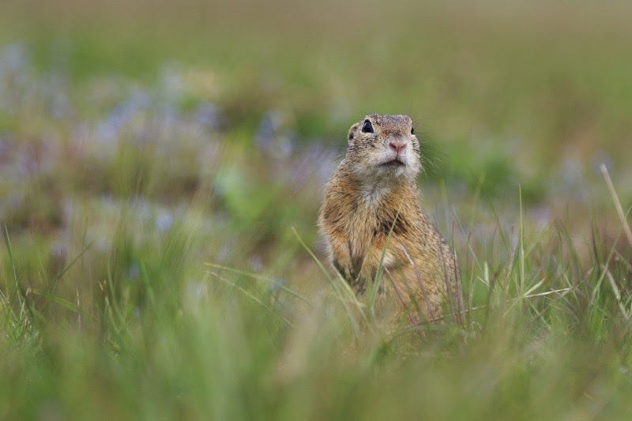

---

### New Release March 2020

Photo by [Zdeněk Macháček](https://unsplash.com/@zmachacek?utm_source=medium&utm_medium=referral) on [Unsplash](https://unsplash.com?utm_source=medium&utm_medium=referral)

### Overview

Our groundhog is still hiding. I hope you like our stand-in!

Let’s start off with some GREAT news! We’ve loaded the Selventa BEL Knowledgebase with 148,000+ literature curated nanopubs resulting in over 2 million edges with orthologization to human, mouse, and rat. (If you need it orthologized to different species, please let us know.) There are now also over 35M computed edges now to help support these edges! This provides a significant knowledge base to start building networks and running analytics.

Just as big, we have updated the curation interface designed to speed your manual curation process. It’s now just one page, so you can see the whole nanopub while you work, and features in-line editing. In-line editing allows you to edit by just clicking a field and typing. You can now move through the whole form by hitting tab — reducing clicks and streamlining your typing. You can find a walk-through of the new Curation Interface here: [Curation Interface](http://help.biodati.com/en/articles/3769967-a-walk-through-the-curation-interface-adding-knowledge).

Everyone loves great error handling and ours has improved. Error messages now appear directly below the problematic Assertion or Annotation.

We have added a “Fix” status for nanopubs and “Internal Comments”. When you identify a nanopub that needs more work before it is Approved, you can set the nanopub status to Fix and add Internal Comments to communicate with your team. Internal Comments are hidden when a nanopub is Approved, and permanently removed when a nanopub is Finalized, Copied or Exported.

We have updated the Knowledge Search interface as well. You can search using simple text for words found in the following parts of a nanopub; the Evidence, Assertions, Annotations, Comments, and Internal Review Comments. You can also do advanced searching using field searches with BEL language and Boolean Operators. Help for advanced searches can be found here: [Advanced Knowledge Searching](http://help.biodati.com/en/articles/2114448-advanced-searching)[.](http://help.biodati.com/en/articles/2114448-advanced-searching.)

We updated the node search, so the shortest matches appear at the top of the list.

We have removed the project label for collections of nanopubs, and replaced it with “collections”. This is to avoid confusion when we unveil our upcoming Projects features.

Coming Next: Bulk Assertion Loading and Reactome content!

### ChangeLog

#### Studio (0.4.0)

#### Added

- Selventa BEL Knowledgebase (148,000 nanopubs)
- New curation interface, single page, inline-editing of Assertions and Annotations
- Nanopub assertions subject/objects to the general knowledge search field
- Can now delete nanopub from the edit form
- Node/edge counts to network search facets

#### Fixed

- Nanopub search bug fixed — search field plus facet filter resulted in an error
- Fixed knowledge search field hints for relation field
- Network facets search bug fixed
- Network visualization — hide selection bug
- Network edge search — shortest path search bug fixed
- Creating new nanopub properly clears nanopub editing form
- Rare race condition in saving a nanopub and getting it before it finished saving resulted in revision error
- Hierarchical visualization would hang
- Node deletion in network node tabular view bug
- Draft networks were incorrectly showing on Dashboard
- Deleted networks were incorrectly showing on Dashboard
- Active network view now shows the Network tabular links by default

#### Changed

- Nanopub.metadata.project -> nanopub.metadata.collections — to keep it distinct from the Projects feature
- Nanopub.metadata.gd\_creator -> nanopub owners — preparing for Groups/Permissions feature
- Network creation edge search node completion — now ranks matches shortest to longest
- Updated knowledge search field hints for metadata.project -> collections
- Improved the notification for importing nanopub and networks

#### Removed

- Projects feature temporarily unavailable
- Nanopub editing restrictions based on status — preparing for Groups/Permissions feature rollout

#### NanopubStore (0.5.0)

#### Changed

- Added top-level admin info to nanopub API responses (e.g. revision, owners, etc) (will not validate to Nanopub JSONSchema without removal)

#### NetworkStore

#### Changed

- Moved edges, lists and styles endpoints to NetworkStore API
