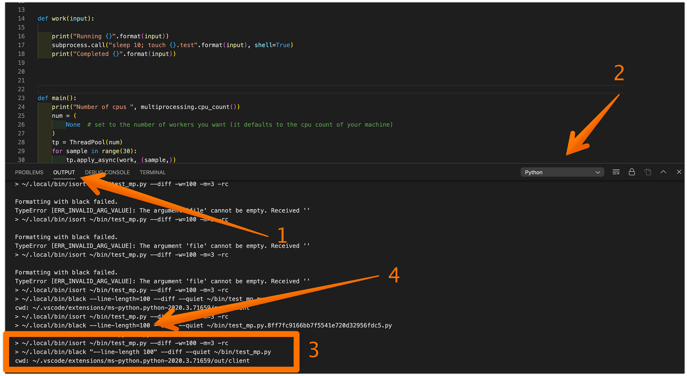
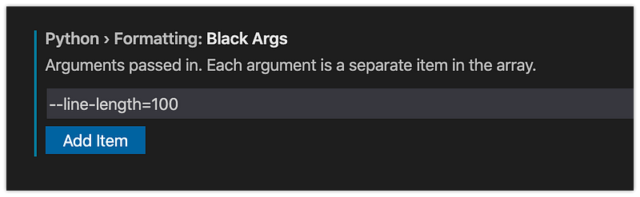

---

*Photo by Markus Spiske on Unsplash*

I use [*black*](https://black.readthedocs.io/en/stable/index.html) and [*isort*](https://github.com/timothycrosley/isort) to format my python programs. I’m very happy for something to take care of that automatically. I just want my python programs to be consistently formatted. It is quite brilliant to force a specific code formatting (even more than what’s required by the Python language). I also very much appreciate the end of the formatting wars with teammates. Code is collaborative — remove opportunities for contention (and spurious git changes) whenever possible.

I had already setup Black and Isort using these [instructions](https://medium.com/@cereblanco/setup-black-and-isort-in-vscode-514804590bf9) (thank you [cereblanco](https://medium.com/u/c90969af998c)!).

Unfortunately, formatOnSave using black for my python programs stopped working. I checked that black and isort were in my path. Still didn’t work.

I checked my *black* settings — as seen below.

Next step was to dig into VSCode and figure out how to check how it is using black. It generally works so well I haven’t paid attention to how to debug it.

Step 1 is to open the Output section of the VSCode Panel

Step 2 select the Python output

Output 3 these are the commands generated by VSCode when running Save on a python file. i*sort* is run first and then *black*. You can take these commands and run them in your own terminal. VSCode uses the diff option and applies the diffs to your file. What you see here though is `black "--line-length 100"` which is not correct.

Output 4 resulted from the following argument entry in VSCode using `--line-length=100` Basically, if VSCode sees a space in your argument, it’s going to quote it, which naturally breaks *black*.

In this exercise, I got black working again — yeah! and I learned more about how VSCode works.

### Thank you

- Tim Crosley and contributors for isort
- [Łukasz Langa](mailto:lukasz%40langa.pl) and contributors for black
- VSCode team
- Python VSCode extension team
