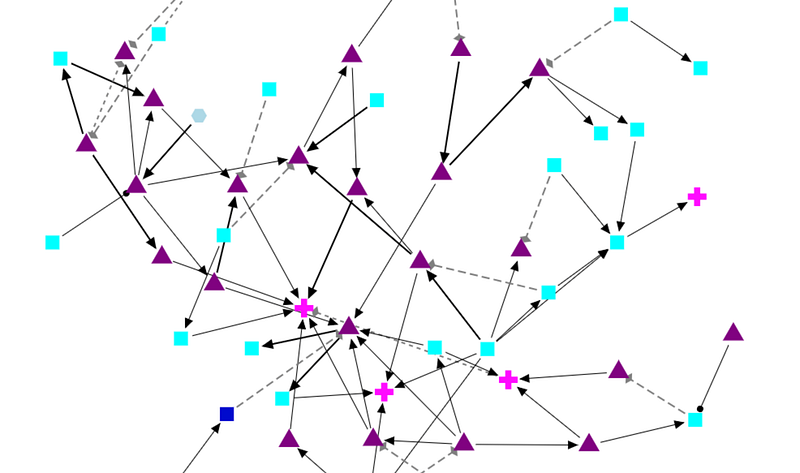

---



### What is BEL?

The Biological Expression Language (BEL) is a language for representing biological observations in a computable form, along with contextual information. BEL is intended as a knowledge capture and interchange medium. BEL is used to qualitatively represent causal and correlative relationships involving biological measurements (e.g., RNA, protein, phosphorylated proteins). Each BEL statement stands alone as an individual observation or fact, and can be integrated with related observations into a cohesive network.

BEL is a human-readable and human-writable language designed to be easy for life scientists to learn and use. It is comprised of a relatively small set of function and relationships types that can be used in conjunction with widely used vocabularies like HGNC human gene symbols, Gene Ontology, ChEBI, and MeSH. As a language of discourse for biological findings, BEL is designed to be “white-boardable” as well as written.

---

### BEL History

BEL was initially designed in 2003 at Selventa® (operating as Genstruct®) by Dexter Pratt. BEL was designed with a focus on capturing qualitative causal relationships that could be used for inference. From 2003 to 2010, BEL evolved in response to daily use by scientists representing findings derived from tens of thousands of abstracts and full-text articles.

In 2011, Selventa proposed to make BEL an open standard. BEL has been refined, formalized, and extended to meet the needs of a broader community to represent, manage, and share scientific findings in the life sciences. BEL and associated software was released as open-source technology in 2012. OpenBEL became a Linux Foundation Collaborative project in 2013 and was transferred to the TranSMART Foundation in 2016.

### BEL Example¹

Evidence sourced from [Pubmed article #10375612](https://www.ncbi.nlm.nih.gov/pubmed/?term=10375612):

> *“Northern blot analysis documented that two transcription factor genes chosen for further study, c-myc promoter-binding protein (MBP-1) and X-box binding protein 1 (XBP-1), were up-regulated in U266 cells about 3-fold relative to the cell cycle-dependent beta-actin gene 12 h after IL-6 treatment”*

Resulting BEL Statements:

```
p(HGNC:IL6) increases r(HGNC:ENO1)
```

```
p(HGNC:IL6) increases r(HGNC:XBP1)
```

Long format of the first statement:

```
proteinAbundance(HGNC:IL6) increases rnaAbundance(HGNC:ENO1)
```

The experimental context is:

```
Species: Human
```

```
Cell Line: U266
```

### Summary

This does not seem that powerful until you realize that you can now structure biological knowledge (or assertions about biology) in such as way that you can accumulate knowledge from many different sources to characterize biology from molecular interactions all the way to phenotypic impacts.

These BEL Statements are triples: subject, relation, object nodes and edges in a network that automatically merge together into large knowledge networks.

We will talk more about this in following posts.

[1] Sourced from the [OpenBEL Language Specification](http://openbel.org/language/version_2.0/bel_specification_version_2.0.html)
